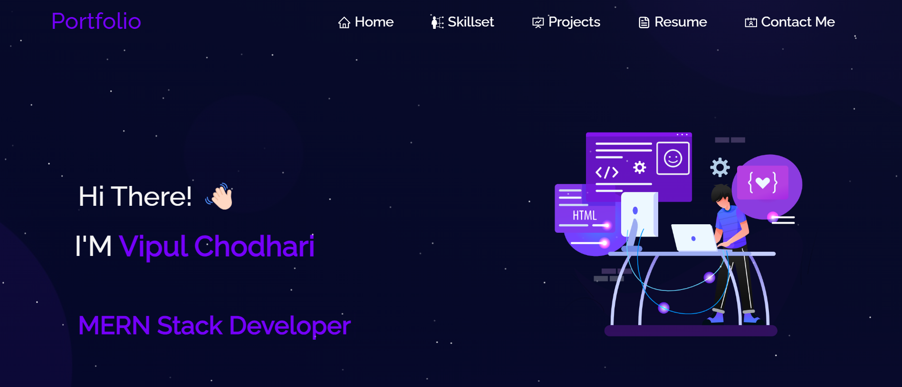

# JS Portfolio Website

[🔗Live Demo🔗](https://vipul-alpha.vercel.app/)

  

<table align="center">
    <thead align="center">
        <tr border: 1px;>
            <td><b>Project Stats</td>
        </tr>
     </thead>
    <tbody>
         <tr>
            <td><a href="https://github.com/Vipchoudhary13/newPortfolio?tab=readme-ov-file"</a>Project</td>
        </tr>
    </tbody>
</table>

 

## Features

**📖 Multi-Page Layout**

**🎨 Styled with React-Bootstrap and CSS with easy to customize colors**

**📱 Fully Responsive**

 

## 🚀 How to get started?

Clone down this repository. You will need `node.js` and `git` installed globally on your machine.

## 🛠 Installation and Setup Instructions

1. Installation: `npm install`

2. In the project directory, you can run: `npm start`

Runs the app in the development mode.\
Open [http://localhost:3000](http://localhost:3000) to view it in the browser. 
The page will reload if you make edits.

 
Feel free to contribute to this repo.

### Show some ❤️&nbsp; by giving the star :star: to this repository!!
<h1 align=center> 🧠 Happy Hacking 🧠 </h1>